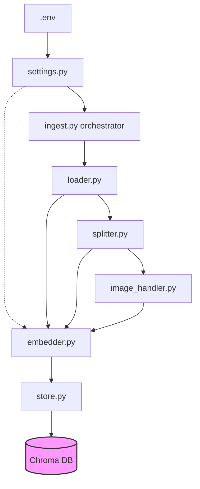

**Author Vivek Khillar**

# WorkFlow to build the applications:

- requirements.txt → Here need to evaluate which library of the python need to use for you application
- .env → Here you have to put all the settings enviroment details (for e.g. how much chunk to process, which model using, server and IP details all)
- settings.py → here using pydantic settings and basesettings class will to read all the values from the .env
- loader.py → here using the pymupdf to read the pdf with images and save the images to the data/images folder and return the map with page as key and value with text and image in list
- splitter.py → here using the same map passing the values of text and splitting into the chunks 
- image_handler.py →
- embedder.py →
- store.py → retriever.py →
- prompt.py → chain.py →
- ingest.py → main.py → 
- Dockerfile → docker-compose.yml →
- docker compose up → test

