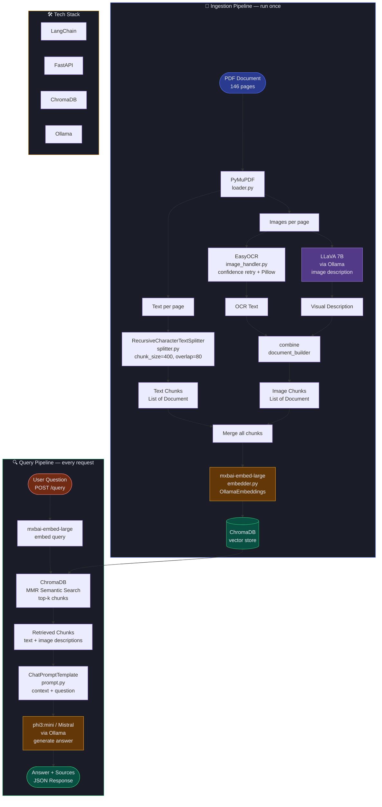
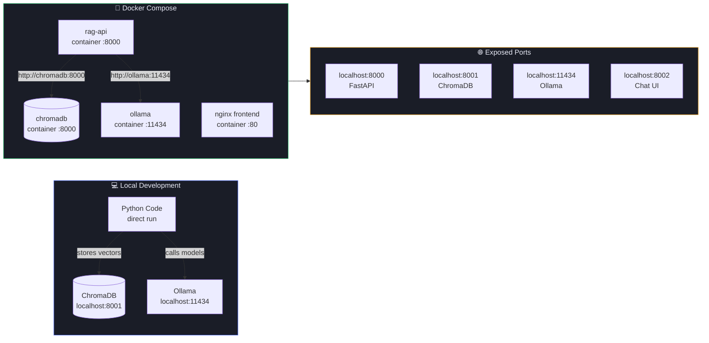
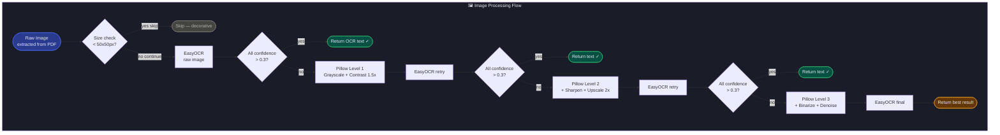

```mermaid
flowchart LR
    subgraph PHASE1["✅ Phase 1 — Classic RAG"]
        A[LangChain\nLinear pipeline]
        B[PDF ingestion\ntext + images]
        C[FastAPI\nquery endpoint]
        D[Docker\nlocal deploy]
    end
 
    subgraph PHASE2["🔄 Phase 2 — Agentic RAG"]
        E[LangGraph\nDecision loop]
        F[Query rewriting\nself correction]
        G[Relevance grading\nretry if poor]
    end
 
    subgraph PHASE3["🤖 Phase 3 — Multi Agent RAG"]
        H[Supervisor agent\norchestrator]
        I[Retriever agent]
        J[Grader agent]
        K[Generator agent]
        L[Web fallback\nagent]
    end
 
    subgraph AWS["☁️ AWS Deployment"]
        M[EC2 instance]
        N[ECR registry]
        O[EBS volume\nmodels + vectors]
    end
 
    PHASE1 -->|upgrade| PHASE2
    PHASE2 -->|upgrade| PHASE3
    PHASE3 -->|deploy| AWS
 
    style PHASE1 fill:#085041,stroke:#34C97A,color:#E8EAF6
    style PHASE2 fill:#1A2A4F,stroke:#4F6EF7,color:#E8EAF6
    style PHASE3 fill:#2A1A4F,stroke:#9F77DD,color:#E8EAF6
    style AWS fill:#3A2A0F,stroke:#F5A623,color:#E8EAF6
```

# 📄 RIL Document QA — Classic RAG System

> An intelligent document Question & Answer system built on Retrieval-Augmented Generation (RAG) architecture. Ask anything about the Reliance Industries Limited Integrated Annual Report 2024-25 and get accurate, source-cited answers powered entirely by free, locally hosted AI models.

---

## 🧠 What is this?

This project implements a **Classic RAG pipeline** that processes a 146-page mixed content PDF (text + images + tables) and enables natural language Q&A over it. The system extracts text , images and tables from the document, converts everything into searchable vector embeddings, and uses a local LLM to generate accurate answers grounded in the document content.

No data leaves your machine. No API keys. No cloud AI costs.

---

## ✨ Features

- **Multimodal ingestion** — extracts text , images and tables from PDF
- **OCR with confidence retry** — EasyOCR with 3-level Pillow preprocessing for low-quality images
- **Vision model descriptions** — LLaVA describes embedded images for visual content retrieval
- **Semantic search** — MMR (Maximal Marginal Relevance) retrieval avoids duplicate chunks
- **Source citations** — every answer includes page numbers and content type (text/image)
- **Chat UI** — clean dark-themed web interface with sample questions
- **Fully local** — all models run via Ollama, no external API calls
- **Docker ready** — containerized with Docker Compose for consistent deployment

---

## 🏗️ Architecture

```
┌─────────────────────────────────────────────────────────┐
│                    INGESTION (run once)                  │
│                                                          │
│  PDF ──► PyMuPDF ──► Text pages ──► Splitter ──────────┐ │
│                  └──► Images ──► OCR + LLaVA ──────────┤ │
│                                                         ▼ │
│                                               ChromaDB     │
│                                               (vectors)    │
└─────────────────────────────────────────────────────────┘

┌─────────────────────────────────────────────────────────┐
│                    QUERY (every request)                 │
│                                                          │
│  User Question                                           │
│       │                                                  │
│       ▼                                                  │
│  mxbai-embed-large (embed query)                        │
│       │                                                  │
│       ▼                                                  │
│  ChromaDB (MMR semantic search → top-k chunks)          │
│       │                                                  │
│       ▼                                                  │
│  Mistral / phi3:mini (generate answer from context)     │
│       │                                                  │
│       ▼                                                  │
│  Answer + Sources returned via FastAPI                   │
└─────────────────────────────────────────────────────────┘
```

---

## 🛠️ Tech Stack

### AI & ML


| Component           | Tool                           | Purpose                                           |
| ------------------- | ------------------------------ | ------------------------------------------------- |
| LLM (Generation)    | `phi3:mini` via Ollama         | Generates answers from retrieved context          |
| Vision Model        | `llava:7b` via Ollama          | Describes images extracted from PDF               |
| Embedding Model     | `mxbai-embed-large` via Ollama | Converts text to vectors for similarity search    |
| OCR                 | EasyOCR                        | Extracts text from images with confidence scoring |
| Image Preprocessing | Pillow (PIL)                   | 3-level image enhancement for low-quality OCR     |


### RAG Framework


| Component          | Tool                             | Purpose                                |
| ------------------ | -------------------------------- | -------------------------------------- |
| RAG Framework      | LangChain                        | Pipeline orchestration, LCEL chains    |
| PDF Parsing        | PyMuPDF (fitz)                   | Text and image extraction from PDF     |
| Text Splitting     | RecursiveCharacterTextSplitter   | Chunk documents into 400-token pieces  |
| Vector Database    | ChromaDB                         | Store and search vector embeddings     |
| Retrieval Strategy | MMR (Maximal Marginal Relevance) | Diverse, non-redundant chunk retrieval |


### Backend & Infrastructure


| Component        | Tool                    | Purpose                                        |
| ---------------- | ----------------------- | ---------------------------------------------- |
| API Framework    | FastAPI                 | REST API with `/query` and `/health` endpoints |
| ASGI Server      | Uvicorn                 | Production-grade Python web server             |
| Model Runtime    | Ollama                  | Local LLM serving                              |
| Containerization | Docker + Docker Compose | Container orchestration                        |
| Web Server (UI)  | Nginx (Alpine)          | Serves the frontend UI                         |


### Configuration & Logging


| Component | Tool                  | Purpose                                       |
| --------- | --------------------- | --------------------------------------------- |
| Settings  | Pydantic BaseSettings | Typed config from `.env` file                 |
| Logging   | Python logging        | Structured logging with file + console output |


---

## 📁 Project Structure

```
CLASSIC_RAG/
│
├── BASE_DIR/                   # Base directory utility
│
├── config/
│   ├── settings.py             # All config via Pydantic BaseSettings
│   └── logger.py               # AppLogger class — structured logging
│
├── ingestion/
│   ├── loader.py               # DocumentLoader — PyMuPDF PDF extraction
│   ├── splitter.py             # DocumentSplitter — RecursiveCharacterTextSplitter
│   ├── embedder.py             # EmbeddingProvider — mxbai-embed-large via Ollama
│   └── image_handler.py        # ImageHandler — OCR + LLaVA image processing
│
├── retrieval/
│   └── retriever.py            # RetrieverBuilder — ChromaDB MMR retriever
│
├── generation/
│   ├── prompt.py               # PromptBuilder — ChatPromptTemplate
│   └── chain.py                # RAGChain — full pipeline: retrieve → prompt → LLM
│
├── vectorstore/
│   └── store.py                # VectorStore — ChromaDB connection + add_documents
│
├── Frontend/
│   └── index.html              # Chat UI — dark themed, source citations, chunk viewer
│
├── data/
│   ├── docs/                   # Drop your PDF here
│   ├── images/                 # Auto-populated during ingestion (extracted images)
│   ├── logs/                   # Auto-populated (app.log)
│   └── preprocessimages/       # Temp Pillow-processed images during OCR
│
├── ingest.py                   # IngestionPipeline — one-time run to index PDF
├── main.py                     # FastAPI app — /health and /query endpoints
├── Dockerfile                  # rag-api container definition
├── docker-compose.yml          # Orchestrates chromadb + rag-api + frontend
├── requirements.txt            # Python dependencies
├── .env                        # Local development config
└── .env.docker                 # Docker environment config
```

---

## ⚙️ Configuration

All config lives in `.env`. Key settings:

```properties
# Models (via Ollama)
OLLAMA_URL=http://localhost:11434
OLLAMA_MODEL=phi3:mini
VISION_MODEL=llava
EMBEDDING_MODEL=mxbai-embed-large

# ChromaDB
CHROMA_HOST=localhost
CHROMA_PORT=8001
CHROMA_COLLECTION=rag_docs

# Chunking
CHUNK_SIZE=400
CHUNK_OVERLAP=80
RETRIEVER_K=4

# Document
DOCS_PATH=data/docs/RIL-Integrated-Annual-Report-2024-25.pdf
PDF_NAME=RIL-Integrated-Annual-Report-2024-25

# OCR
ocr_texfinding_confidence_level=0.3
MAXIMUM_IMAGE_PROCESS_level=3
```

---

## 🚀 Running the Project

### Prerequisites

- Python 3.11+
- Docker Desktop
- Ollama installed locally or via Docker

---

### Option A — Local Development (no Docker for code)

**Step 1 — Install Ollama and pull models**

```bash
# Pull all required models
ollama pull phi3:mini
ollama pull llava
ollama pull mxbai-embed-large
```

**Step 2 — Start ChromaDB**

```bash
docker compose up chromadb -d
```

**Step 3 — Install Python dependencies**

```bash
python -m venv venv
source venv/bin/activate        # Mac/Linux
venv\Scripts\activate           # Windows

pip install -r requirements.txt
```

**Step 4 — Configure environment**

```bash
cp .env.example .env
# Edit .env with your settings
```

**Step 5 — Run ingestion (one time)**

```bash
# Drop your PDF into data/docs/ first
python ingest.py
```

Expected output:

```
INFO  | Step 1: Loading document...     → 146 pages loaded
INFO  | Step 2: Splitting text...       → 412 text chunks created
INFO  | Step 3: Splitting text...       → 0 table documents created
INFO  | Step 4: Processing images...    → 87 image documents created
INFO  | Step 5: Merging all chunks...   → 499 total chunks
INFO  | Step 6: Storing in ChromaDB...  → Done ✓
```

**Step 6 — Start the API**

```bash
uvicorn main:app --host 0.0.0.0 --port 8000 --reload
```

**Step 7 — Open the UI**

Open `Frontend/index.html` directly in your browser or serve it:

```bash
# Using Python simple server
cd Frontend
python -m http.server 8002
# Open http://localhost:8002
```

---

### Option B — Full Docker Deployment

**Step 1 — Pull Ollama models** (if not already done)

```bash
ollama pull phi3:mini
ollama pull llava
ollama pull mxbai-embed-large
```

**Step 2 — Build and start all containers**

```bash
docker compose build
docker compose up -d
```

**Step 3 — Verify all containers running**

```bash
docker compose ps
```

```
NAME           STATUS    PORTS
chromadb       running   0.0.0.0:8001->8000/tcp
rag-api        running   0.0.0.0:8000->8000/tcp
rag-frontend   running   0.0.0.0:8002->80/tcp
```

**Step 4 — Run ingestion**

```bash
docker exec rag-api python ingest.py
```

**Step 5 — Test**

```bash
# Health check
curl http://localhost:8000/health

# Query
curl -X POST http://localhost:8000/query \
  -H "Content-Type: application/json" \
  -d '{"question": "What is RIL EBITDA in 2024-25?"}'
```

**Step 6 — Open UI**

```
Browser → http://localhost:8002
```

---

## 🌐 API Reference

### Health Check

```
GET /health

Response:
{
  "status": "ok"
}
```

### Query

```
POST /query

Request:
{
  "question": "What is the EBITDA of Reliance in FY 2024-25?"
}

Response:
{
  "answer": "Reliance Industries reported EBITDA of ₹1,83,422 crore...",
  "sources": [
    { "page": 5,  "type": "text",  "source": "RIL...pdf" },
    { "page": 4,  "type": "table",  "source": "RIL...pdf" },
    { "page": 22, "type": "image", "source": "RIL...pdf" }
  ]
}
```

---

## 🔌 Port Map


| Service  | Local URL                                        | Purpose                  |
| -------- | ------------------------------------------------ | ------------------------ |
| RAG API  | [http://localhost:8000](http://localhost:8000)   | FastAPI — query endpoint |
| ChromaDB | [http://localhost:8001](http://localhost:8001)   | Vector database          |
| Frontend | [http://localhost:8002](http://localhost:8002)   | Chat UI                  |
| Ollama   | [http://localhost:11434](http://localhost:11434) | LLM model server         |


---

## 🖼️ How Image Processing Works

```
PDF Image Extracted
        │
        ▼
EasyOCR → raw text attempt
        │
   confidence > 0.3 for ALL results?
        │
   YES  → return text ✓
        │
   NO   → Pillow preprocessing
        │
        ├── Level 1: Grayscale + Contrast 1.5x
        ├── Level 2: + Sharpen 2.0x + Upscale 2x
        └── Level 3: + Binarize + Noise removal
        │
        ▼
LLaVA Vision Model → image description
        │
        ▼
Combined content:
"<LLaVA description>\n\nText found in image: <OCR text>"
        │
        ▼
Stored as Document in ChromaDB with type="image"
```

---

## 📊 Ingestion Pipeline

```
IngestionPipeline.run()
        │
        ▼
DocumentLoader.load()           → page_map {page: {Text, Images,tables}}
        │
        ├──────────────────────────────────┐─────────────────────────────────┐
        ▼                                  ▼                                 ▼
DocumentSplitter.split()        ImageHandler.image_documents()       table_handler.table_documents()
→ 400-token text chunks         → OCR + LLaVA per image              → find_tables per page            
→ List[Document]                → List[Document]                     → List[Document]        
        │                                  │                                 │
        └──────────────────────────────────┘─────────────────────────────────┘
                                           ▼
                                   all_docs merged
                                           │
                                           ▼
                        embeed_vector_store.vector_store()
                        → mxbai-embed-large embeds all docs
                        → ChromaDB stores vectors + metadata
                                           │
                                           ▼
                                        Done ✓
```

---

## 🗺️ Roadmap

- **Phase 1** — Classic RAG with multimodal PDF support
- **Phase 2** — Agentic RAG with LangGraph (query rewriting, self-correction loop)
- **Phase 3** — Multi-Agent RAG (retriever agent, grader agent, generator agent, web fallback agent)
- **AWS Deployment** — EC2 + ECR + EBS for cloud hosting

---

## 🤝 Contributing

This project is structured for progressive enhancement across 3 RAG phases. Each phase builds on the previous without breaking existing functionality.

---

## 📝 Notes

- **Ingestion is a one-time operation** — re-run only when PDF changes
- **LLaVA is only used during ingestion** — not at query time
- **All models are free** — no OpenAI, no Anthropic, no cloud costs
- **ChromaDB data persists** via Docker volume `chroma_data`
- **Ollama model data persists** via Docker volume `ollama_data`
- **.env** The project will run once you get the .env file configurations `Please raise a request for this`


 
---
 

 
---
 

 
---
 

```